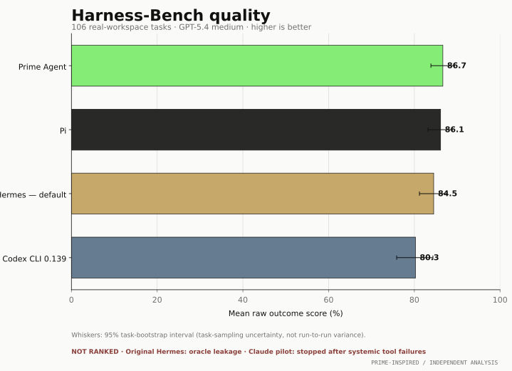

# Harness-Bench: audited harness comparison

A shareable comparison of four complete GPT-5.4-medium harness configurations across the same 106 real-workspace tasks. Open [`index.html`](index.html) for the polished report.



## Headline comparison

The main charts include **Prime Agent**, **Pi**, **Codex CLI 0.139**, and **contained benchmark-default Hermes**. Fixed Hermes variants are intentionally reserved for the separate ablation note below.

Raw outcome score is the common `scoring.outcome_score`. **Input tokens** are standardized as `Total − Cache read − Output`; the three displayed components are therefore non-overlapping and sum to Total. This corrects Codex’s native convention, where reported input includes cache reads. The untouched provider value remains available as `reported_input_tokens` in the CSV snapshots for auditability.

| Option | Score | Input tokens | Cache read tokens | Output tokens | Total tokens | Calls | Runtime |
|---|---:|---:|---:|---:|---:|---:|---:|
| Prime Agent | 86.65% | 1,387,583 | 3,663,872 | 314,356 | 5,365,811 | 670 | 1.87 h |
| Pi | 86.12% | 853,187 | 1,489,152 | 308,079 | 2,650,418 | 558 | 1.95 h |
| Hermes — default | 84.51% | 2,292,231 | 18,115,968 | 567,375 | 20,975,574 | 966 | 3.40 h |
| Codex CLI 0.139 | 80.26% | 1,544,276 | 13,760,384 | 505,527 | 15,810,187 | 649 | 2.92 h |

Runtime is summed task elapsed time, not end-to-end wall-clock.

## Figures

- [`overall_quality.svg`](figures/overall_quality.svg) — headline quality with 95% task-bootstrap intervals
- [`topic_quality_facets.svg`](figures/topic_quality_facets.svg) — quality across the eight declared task classes
- [`quality_efficiency_frontier.svg`](figures/quality_efficiency_frontier.svg) — aggregate score against tokens and runtime
- [`task_tokens_facets.svg`](figures/task_tokens_facets.svg) — task-level score against tokens, colored by task class
- [`task_runtime_facets.svg`](figures/task_runtime_facets.svg) — task-level score against runtime, colored by task class

PNG versions are provided for slides and social sharing; SVG versions are preferred for documents.

## Hermes profile comparison

Only contained benchmark-default Hermes appears in the headline comparison. Focused/aggressive were a separate, counterbalanced post-hoc ablation and must not be pooled with the default rerun.

| Hermes profile | Role | Score | Total tokens | Calls | Runtime |
|---|---|---:|---:|---:|---:|
| Default | Headline contained rerun | 84.51% | 20,975,574 | 966 | 3.40 h |
| Focused with skills | Post-hoc fixed skills surface | 85.09% | 16,762,811 | 1,022 | 3.44 h |
| Aggressive without skills | Post-hoc same surface minus skills | 85.30% | 10,046,032 | 921 | 3.27 h |

Aggressive minus focused was **+0.21 percentage points**, with paired wins/ties/losses **15/67/24**, paired t-test **p=0.861**, and task-bootstrap 95% CI approximately **[-2.12, +2.59] points**. No statistically detectable quality difference was observed in this single-run paired comparison, while aggressive used about **40% fewer tokens**, 9.9% fewer calls, and 4.9% less runtime.

Six aggressive cells—091, 094, 096, 097, 099, and 106—use separately preserved corrections after a terminal audit classified their originals as watchdog-truncated infrastructure failures.

## Scope and exclusions

- **Original Hermes is excluded.** Four tasks (037, 046, 055, and 079) accessed oracle or ground-truth material. Only the separately contained rerun appears in the headline charts.
- **The Claude Code Opus 4.6 pilot is not a valid baseline.** Nine completed tasks averaged 9.3%, but post-stop trace diagnosis found that all **51/51 Bash calls** failed before shell startup with `E2BIG`, while all **30/30 Write** and **8/8 Edit** calls were denied by the noninteractive permission policy. With no mutation channel, the tasks were technically impossible to complete. Several traces nevertheless identified the expected content or fix before failing to persist it.
- Claude processed an estimated **2,083,848 standardized model-context tokens** on those nine tasks (238,287 fresh/cache-creation input + 1,781,029 cache reads + 64,532 output). That is high—especially the retry-inflated output—but only 11% above default Hermes and 29% above Codex on the same tasks; it is not interpretable as normal Claude efficiency. A future attempt should first fix the permission contract and oversized native sandbox profile, then pass an exact production Write/Edit/Bash containment canary and a single-task smoke. No Claude scores appear in the comparison.
- Headline scores are raw outcomes. Prime and Pi have full-trace-v2 process grades, but those are not mixed here because equivalent grades are not yet available for Codex and contained Hermes.
- Tasks 008 and 013 retain the benchmark's documented oracle-quality-LLM comparability caveat.
- Headline bar charts use explicitly labeled focused axes (50 overall; 45 by topic because one topic score is 48.3) to make modest differences legible; bar area should not be interpreted as a ratio from zero.
- Bootstrap intervals quantify sensitivity to the sampled task set, **not** run-to-run model variance.
- Task-level regression lines are descriptive OLS fits on log resource use. They are not causal: task difficulty affects both score and resource use.

## Audited composition

- **Codex:** 105 entries from the initial full manifest plus only the second operational correction for task 023. The initial task and failed first correction remain preserved but excluded.
- **Categories:** the `class` field in each `tasks/<task>/task.yaml`; no category is inferred from task number or name.

Normalized snapshots live in [`data/`](data/): task metadata, 636 task-level rows (including the separately labeled Hermes ablations), aggregates, topic summaries, exclusions, and provenance. [`data/provenance.json`](data/provenance.json) records 665 SHA-256-bound raw inputs, including four retained original-Hermes and nine invalid-Claude-pilot evidence records. The generator hard-fails if any published aggregate differs from the audited toplines.

## Reproduce

From the repository root:

```bash
MPLBACKEND=Agg .venv/bin/python evaluation/results/gpt54-harness-report/generate_report.py
```

The generator reads audited local/external run roots and regenerates the report without launching models or modifying evaluation roots. Full raw-source regeneration requires ignored/private run artifacts that are not distributed here; external recipients can still inspect and reuse the normalized snapshots and compare the accompanying raw-input inventory.

## Design

The visual system takes restrained inspiration from Prime Intellect's current editorial language: warm neutral paper, dark ink, compact mono labels, and a single highlighter-green accent. It deliberately avoids logos or close brand imitation.
