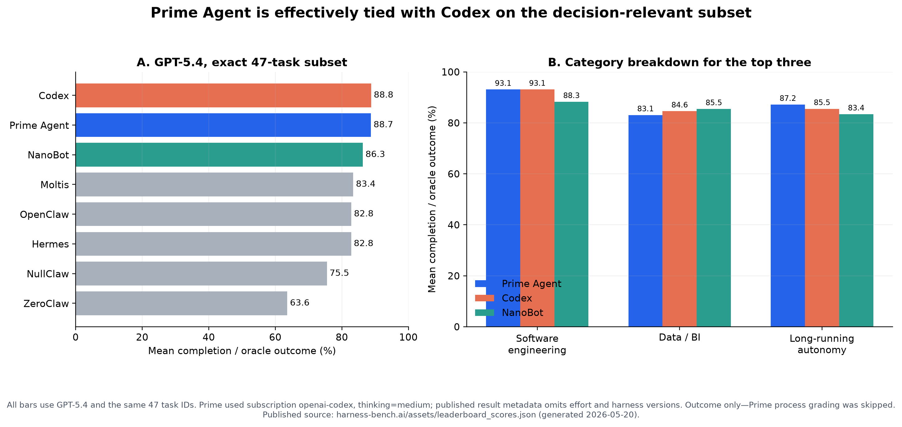
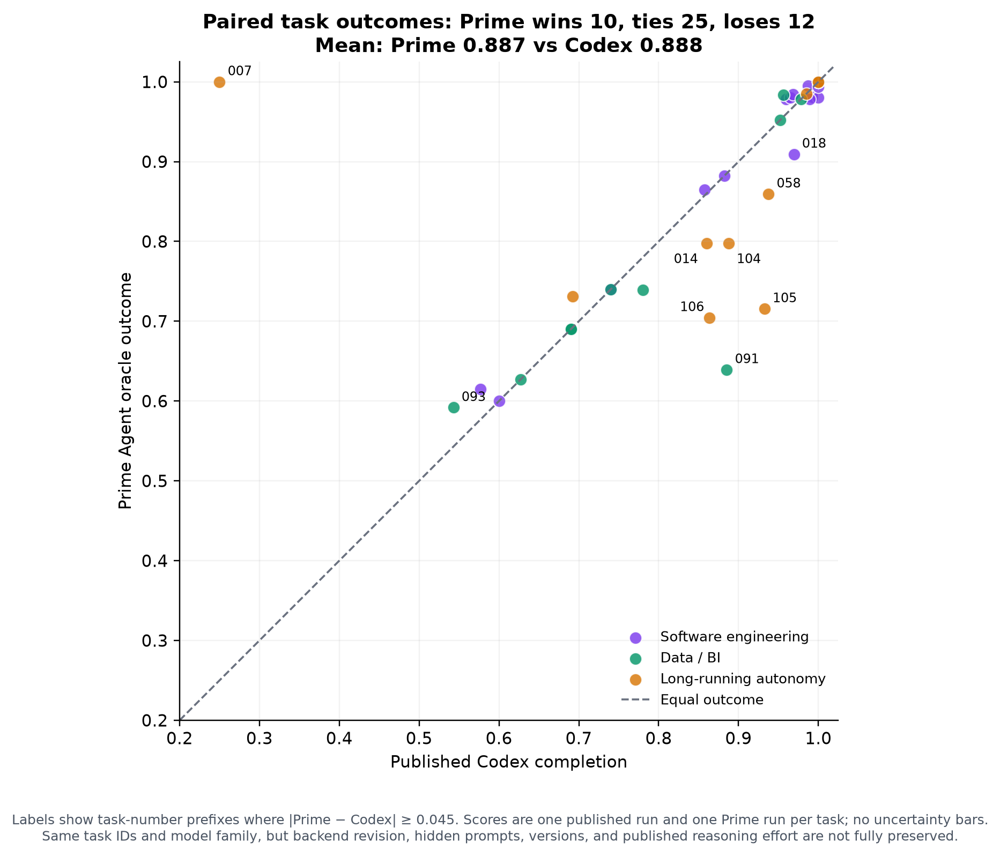

# Prime Agent versus published GPT-5.4 harness results

## What is being compared

The Harness-Bench authors publish one row per task/harness/model in [`leaderboard_scores.json`](https://www.harness-bench.ai/assets/leaderboard_scores.json). I selected the exact same 47 task IDs used for the predefined Prime subset and restricted the published matrix to `model="gpt-5.4"`. The derived source rows and provenance are retained in `published-gpt-5.4-subset-baseline.json`.

This is a substantially better comparison than juxtaposing unrelated paper aggregates: the model label and task IDs match exactly. It is still not a perfect controlled ablation. The published JSON omits reasoning effort, backend revision, harness versions, benchmark SHA, and raw trajectories. The released Codex configuration is GPT-5.4 medium, but the paper calls Codex’s run its “default model configuration,” so medium effort is strong circumstantial evidence rather than preserved run metadata. Prime used subscription-backed `openai-codex/gpt-5.4` with thinking `medium`.

Only completion/oracle outcome is compared. Prime intentionally skipped process grading, so comparing Prime outcome to published combined scores would be invalid.

## Results

### Overall means

| Harness | Mean outcome | Mean time/task | Mean tokens/task |
|---|---:|---:|---:|
| Codex | 0.8880 | — | — |
| Prime Agent | 0.8873 | 74.5s | 61,975 |
| NanoBot | 0.8631 | — | — |
| Hermes | 0.8280 | — | — |

### Overall medians

| Harness | Median outcome | Median time/task | Median tokens/task |
|---|---:|---:|---:|
| Prime Agent | 0.9800 | 69.2s | 51,222 |
| Codex | 0.9685 | — | — |
| NanoBot | 0.9524 | — | — |
| Hermes | 0.9186 | — | — |

Prime Agent and Codex are effectively tied overall: **0.8873 versus 0.8880**, a difference of **−0.0007** (−0.07 percentage points). Their software means are nearly identical (**0.9310 vs 0.9312**). Prime is **+1.65 points** on long-running autonomy and **−1.50 points** on data/BI. Prime is **+2.43 points** over the next overall configurable harness, NanoBot, on this subset.

The public score file has no per-task timing or usage. Its separate usage file publishes only full-106 aggregates, and published token totals use different cache accounting from Prime. I therefore leave resource cells blank rather than mix scopes or definitions. Prime's category-level resource breakdown is:

| Prime subset | Tasks | Outcome | Mean time/task | Median time/task | Mean tokens/task | Median tokens/task |
|---|---:|---:|---:|---:|---:|---:|
| Overall | 47 | 0.8873 | 74.5s | 69.2s | 61,975 | 51,222 |
| Software engineering | 22 | 0.9310 | 73.8s | 59.3s | 68,189 | 52,747 |
| Data/BI | 14 | 0.8309 | 67.4s | 68.9s | 57,351 | 51,002 |
| Long-running autonomy | 11 | 0.8718 | 84.8s | 76.3s | 55,435 | 42,079 |

Against Codex task-by-task, Prime wins 10, ties 25 exactly, and loses 12. The large number of exact ties is evidence that the common GPT-5.4 backend and deterministic task contracts explain much of the result; harness differences are concentrated in a smaller set of tasks.

| Largest Prime advantages | Δ | Largest Codex advantages | Δ |
|---|---:|---|---:|
| `007-session-memory` | +0.7500 | `091-financial-close-reconciliation` | -0.2459 |
| `093-jsonl-sessionization-analysis` | +0.0489 | `105-partial-batch-resume-ledger` | -0.2169 |
| `047-code-review-risk-report` | +0.0385 | `106-release-approval-gate-plan` | -0.1591 |
| `057-interruption-resume` | +0.0385 | `104-async-ops-window-rollup` | -0.0900 |
| `055-funnel-dropoff-analysis` | +0.0273 | `058-multiday-project-state` | -0.0781 |

One important sensitivity check: task `007-session-memory` alone gives Prime a +0.75 advantage (1.00 versus Codex 0.25). Excluding it, Prime trails Codex by about **1.70 points** over the other 46 tasks. Accordingly, “tied overall” is literally correct for the frozen aggregate, but it should not be read as proof that the harnesses are interchangeable. Prime’s median is slightly higher (0.9800 versus 0.9685), while Codex has one more perfect task and one more task at or above 0.9.

## Interpretation

### Where Prime looks strong

1. **Coding execution and verification.** Prime scored 0.9310 on software work, essentially equal to Codex and above NanoBot’s 0.8828. It was perfect or near-perfect on code repair, frontend/type bugs, migration safety, performance regression, monorepo repair, CI repair, dependency compatibility, and flaky-test repair. Prime’s persistent Python environment makes repository inspection, small scripts, test execution, and artifact edits a natural tight loop.
2. **Operational reliability.** Every retained task ended with adapter success and a valid final stop; there were no provider timeouts or trace-extraction failures. Once benchmark dependency/path defects were corrected, Prime used the intended environment consistently. This matters for a harness: capability that fails to commit artifacts or terminate cleanly is not useful capability.
3. **Stateful work is promising.** Prime led Codex and NanoBot on the long-running category. The clearest win is `007-session-memory`, and Prime also handled event-update replanning, cancellation cleanup, periodic rollups, and policy-update diffs well. Native session resume appears to be doing real work rather than merely replaying prompts.
4. **Competitive without excessive fresh-token use.** Prime reported 2.91M total tokens over the subset, 71% of which were cache reads. That suggests its persistent/session-heavy design makes good use of caching. I do not make a numerical efficiency comparison because the public site does not expose exact-subset per-run usage and its aggregate “total” excludes cache reads differently.

### Where Prime looks weaker

1. **Exact business ontologies and output contracts.** The data/BI gap comes mostly from plausible analyses that miss an exact label, status, carry-forward rule, or row convention. Examples include attribution vocabulary in `090`, financial reconciliation semantics in `091`, session campaign handling in `093`, and diff/caveat requirements in `094`. Prime is good at doing the computation; it is less consistent at converting every implicit business rule into an exhaustive output contract.
2. **Long-running bookkeeping is not uniformly solved.** Prime’s category win is dominated by `007`. It lost materially to Codex on `104`, `105`, and `106`, where success depends on precise seen-state windows, retry-ledger semantics, blocker schemas, and approval records. Persistence preserves state, but it does not automatically make that state schema correct.
3. **Completion checking could be more explicit.** Several genuine misses look like “substantial work completed, one required field/check omitted.” Prime currently relies on the model to decide it is done. A task-agnostic final pass that inventories requested deliverables, validates schemas, and reruns available tests would likely help more than simply granting more turns. In this run, calls and token volume were weakly negatively correlated with score, so more budget alone is not the obvious fix.

### What I would and would not conclude

- **I would conclude** that Prime Agent is already a top-tier GPT-5.4 harness on the work mix you care about. On the exact frozen subset, it is statistically unreplicated but numerically indistinguishable from the authors’ Codex reference and ahead of the six published configurable harnesses.
- **I would not conclude** that Prime causally beats or equals Codex in general. These are single trajectories; published effort/backend/version metadata is incomplete; hidden prompts and tools differ; one state-memory task moves the aggregate materially; and Prime lacks comparable process scores.
- The strongest qualitative reading is: **GPT-5.4 supplies most of the capability, while Prime exposes it very well for coding and stateful workflows; its main remaining harness opportunity is stricter contract/state validation before stopping.**

## Sources and reproducibility

- Authors’ leaderboard: <https://www.harness-bench.ai/leaderboard.html>
- Authors’ run-level scores: <https://www.harness-bench.ai/assets/leaderboard_scores.json>
- Paper: <https://arxiv.org/abs/2605.27922>
- Released GPT-5.4 medium config: <https://github.com/Qihoo360/harness-bench/blob/1025086a446653702b80cfb48babbeec35db6b2c/config/harness.example.yaml>
- Plot generator: `evaluation/plot_prime_comparison.py`
